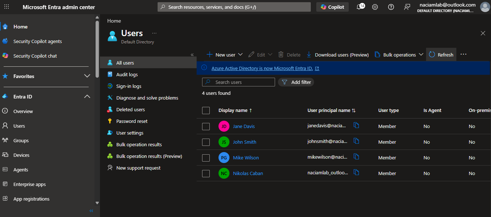
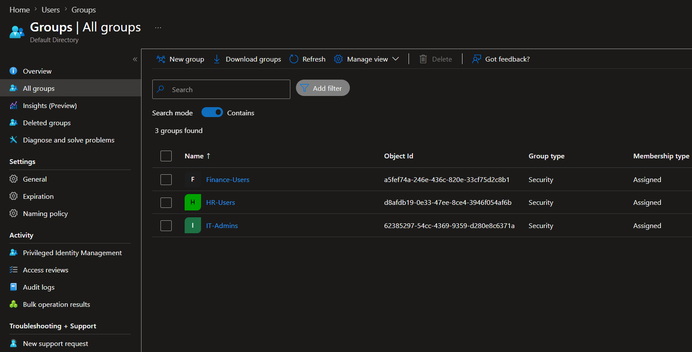
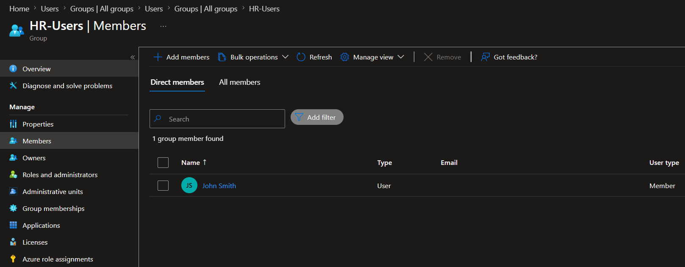
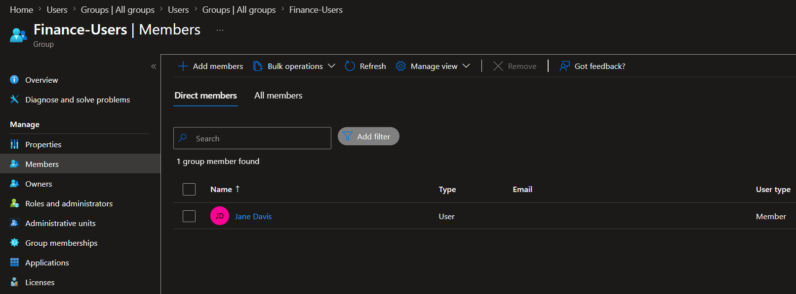
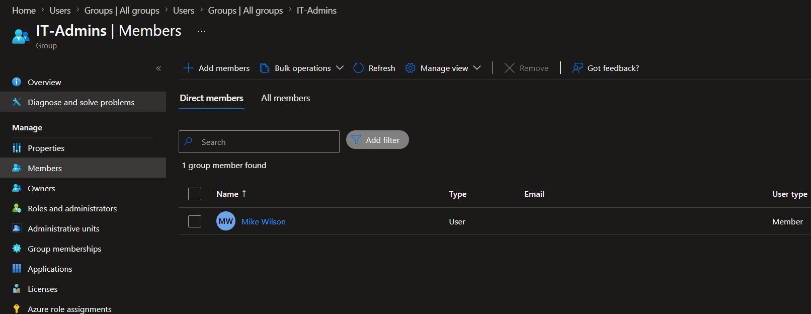

# Lab 01 - Identity Lifecycle Management for Caban Technologies

## Company

**Caban Technologies**

Departments:

* Human Resources (HR)
* Finance
* Information Technology (IT)

---

## Objective

## Objective

Demonstrate identity lifecycle management fundamentals using Microsoft Entra ID.

This lab focuses on user provisioning, security group management, department-based user organization, and identity governance fundamentals.

---

## Environment

### Platform

* Microsoft Entra ID
* Azure Portal

### Security Controls

* Multi-Factor Authentication (MFA)
* Security Groups
* Role-Based Access Control (RBAC)

---

## Tasks Completed

### User Provisioning

Created the following users:

| User        | Department |
| ----------- | ---------- |
| John Smith  | HR         |
| Jane Davis  | Finance    |
| Mike Wilson | IT         |

### Security Group Creation

Created the following security groups:

| Group Name    |
| ------------- |
| HR-Users      |
| Finance-Users |
| IT-Admins     |

### Group Membership Assignment

Assigned users to the appropriate security groups:

| User        | Group         |
| ----------- | ------------- |
| John Smith  | HR-Users      |
| Jane Davis  | Finance-Users |
| Mike Wilson | IT-Admins     |

---

## IAM Concepts Demonstrated

### Identity Provisioning

Created and configured new user accounts within Microsoft Entra ID.

### Security Group Administration

Created security groups to organize users based on job function and department.

### Role-Based Access Control Foundations (RBAC)

Established group structures that can be used to support role-based access control and least-privilege access management.

### Identity Lifecycle Management

Simulated the onboarding process for new employees by assigning departments and group memberships.

### Multi-Factor Authentication (MFA)

Configured Microsoft Authenticator MFA for the Global Administrator account used to manage the lab environment.

---

## Business Scenario

Caban Technologies requires a standardized onboarding process for new employees.

The identity team is responsible for:

1. Creating user accounts.
2. Assigning department attributes.
3. Assigning users to appropriate security groups.
4. Enforcing MFA requirements.
5. Maintaining least-privilege access principles.

This lab simulates the initial onboarding phase of that process.

---

## Evidence

### Users Created

### Security Groups

### HR Group Membership

### Finance Group Membership

### IT Group Membership

---

## Skills Developed

* Microsoft Entra ID Administration
* User Provisioning
* Security Group Management
* Identity Lifecycle Management
* RBAC Fundamentals
* MFA Administration
* Access Management
* IAM Documentation
