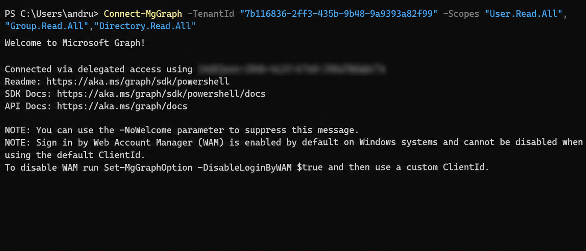
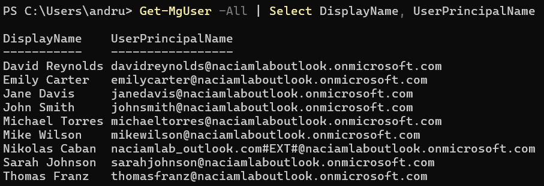
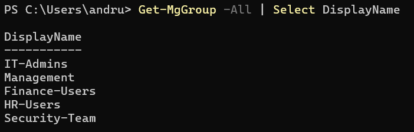
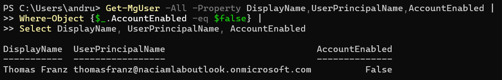

# Lab 4 - Microsoft Graph Identity Inventory

## Overview

This lab demonstrates the use of Microsoft Graph PowerShell to inventory and audit identity resources within a Microsoft Entra ID tenant.

Microsoft Graph provides a programmatic interface for managing users, groups, and directory resources. In this lab, Microsoft Graph PowerShell was used to connect to the tenant, enumerate users, enumerate groups, and identify disabled accounts.

This lab represents a shift from graphical administration to automation and scripting within an IAM environment.

---

## Objectives

- Install and configure Microsoft Graph PowerShell
- Authenticate to Microsoft Entra ID using Microsoft Graph
- Enumerate users through PowerShell
- Enumerate groups through PowerShell
- Identify disabled accounts
- Demonstrate directory auditing through automation

---

## Business Scenario

Caban Technologies requires the IAM team to maintain visibility into directory objects and access assignments.

Manual review through the Microsoft Entra portal can become inefficient as environments grow. To improve efficiency and support audit activities, Microsoft Graph PowerShell was used to retrieve user and group information directly from the directory.

The IAM team also performed a review of disabled accounts to validate previous offboarding activities.

---

## Microsoft Graph Connection

Microsoft Graph PowerShell was configured and authenticated using delegated permissions.

### Permissions Used

- User.Read.All
- Group.Read.All
- Directory.Read.All

These permissions allow read-only access to users, groups, and directory resources for auditing and reporting purposes.

---

## User Inventory

Microsoft Graph was used to retrieve user accounts from the Microsoft Entra tenant.

### Command Used

```powershell
Get-MgUser -All | Select DisplayName, UserPrincipalName
```

Purpose:

- Enumerate directory users
- Validate user provisioning
- Support access reviews
- Generate identity reports

---

## Group Inventory

Microsoft Graph was used to retrieve security groups from the tenant.

### Command Used

```powershell
Get-MgGroup -All | Select DisplayName
```

Purpose:

- Review group structure
- Validate access assignments
- Support RBAC administration
- Audit security groups

---

## Disabled Account Review

Microsoft Graph was used to identify disabled user accounts.

### Command Used

```powershell
Get-MgUser -All -Property DisplayName,UserPrincipalName,AccountEnabled |
Where-Object {$_.AccountEnabled -eq $false} |
Select DisplayName, UserPrincipalName, AccountEnabled
```

Purpose:

- Identify inactive accounts
- Validate offboarding procedures
- Support IAM audits
- Reduce unauthorized access risk

The disabled account review successfully identified the user account disabled during the offboarding process completed in Lab 3.

---

## Key Concepts Demonstrated

- Microsoft Graph PowerShell
- Microsoft Entra ID Administration
- Identity Inventory Management
- User Auditing
- Group Auditing
- Access Reviews
- IAM Automation
- PowerShell Administration
- Directory Reporting

---

## Evidence

### Microsoft Graph Authentication



### User Inventory



### Group Inventory



### Disabled Account Audit



---

## Outcome

Successfully connected to Microsoft Entra ID using Microsoft Graph PowerShell and performed identity inventory operations including user enumeration, group enumeration, and disabled account auditing. This lab demonstrates foundational IAM automation skills and the ability to interact with directory resources programmatically.
