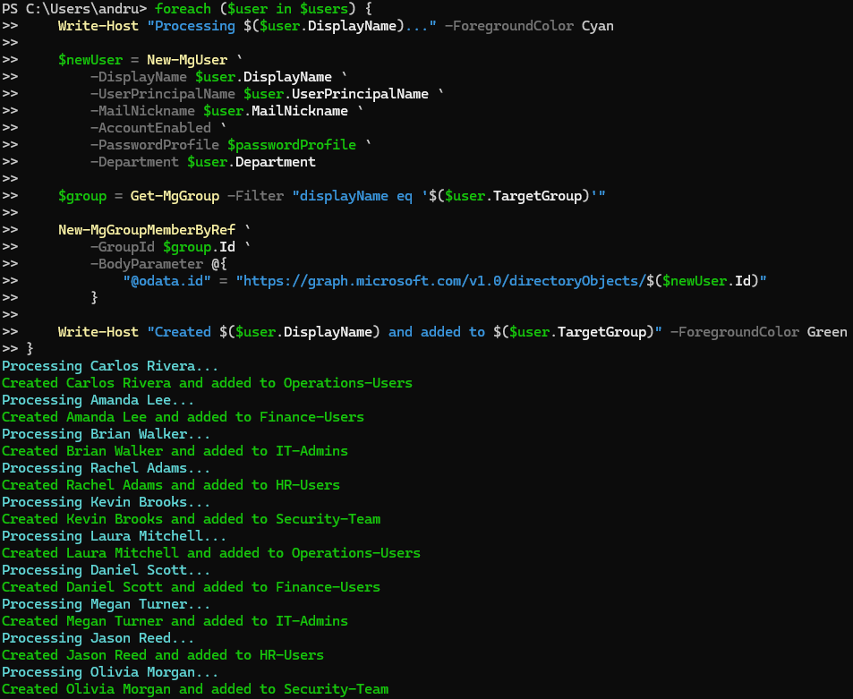
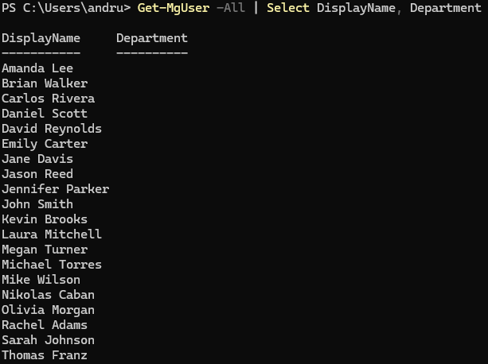
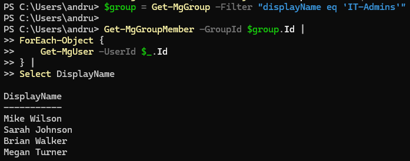

# Lab 5 - Automated User Provisioning and Group Assignment with Microsoft Graph

## Overview

This lab demonstrates automated user provisioning within Microsoft Entra ID using Microsoft Graph PowerShell.

A CSV file containing employee information was imported into PowerShell and used to automate the onboarding process for multiple users. The automation workflow created user accounts, assigned organizational departments, and automatically added users to the appropriate security groups based on business requirements.

This lab simulates a common enterprise IAM onboarding workflow where HR provides a list of new hires and the IAM team automates account creation and access assignment.

---

## Objectives

* Import user data from a CSV file
* Automate user account creation using Microsoft Graph PowerShell
* Assign department attributes during provisioning
* Automatically assign group memberships based on business rules
* Validate user creation
* Verify group membership assignments

---

## Business Scenario

Caban Technologies is onboarding multiple new employees across several departments.

To reduce manual administrative effort and improve consistency, the IAM team developed an automated provisioning process that:

* Reads employee information from a CSV file
* Creates user accounts in Microsoft Entra ID
* Assigns organizational department information
* Automatically grants access through security group membership

This process helps standardize onboarding and reduces the risk of human error.

---

## Technologies Used

* Microsoft Entra ID
* Microsoft Graph PowerShell
* PowerShell
* CSV Data Import
* Security Groups
* Role-Based Access Control (RBAC)

---

## Provisioning Workflow

### Input Data

Employee information was stored within a CSV file containing:

* Display Name
* User Principal Name
* Mail Nickname
* Department
* Target Security Group

Example Departments:

* Finance
* Human Resources
* Information Technology
* Security
* Operations

---

## Automation Process

The provisioning script performed the following actions:

1. Imported employee records from a CSV file.
2. Created new user accounts using Microsoft Graph PowerShell.
3. Assigned department attributes to each account.
4. Identified the appropriate security group.
5. Added the user to the designated group.
6. Generated confirmation output for each successful provisioning action.

---

## Security Groups Utilized

### IT-Admins

Assigned to Information Technology personnel.

### Finance-Users

Assigned to Finance personnel.

### HR-Users

Assigned to Human Resources personnel.

### Security-Team

Assigned to Security personnel.

### Operations-Users

Assigned to Operations personnel.

---

## Example Provisioned Users

| User           | Department | Assigned Group   |
| -------------- | ---------- | ---------------- |
| Amanda Lee     | Finance    | Finance-Users    |
| Daniel Scott   | Finance    | Finance-Users    |
| Brian Walker   | IT         | IT-Admins        |
| Megan Turner   | IT         | IT-Admins        |
| Rachel Adams   | HR         | HR-Users         |
| Jason Reed     | HR         | HR-Users         |
| Kevin Brooks   | Security   | Security-Team    |
| Olivia Morgan  | Security   | Security-Team    |
| Carlos Rivera  | Operations | Operations-Users |
| Laura Mitchell | Operations | Operations-Users |

---

## Key IAM Concepts Demonstrated

* Automated User Provisioning
* Identity Lifecycle Management
* Access Assignment
* Security Group Administration
* Microsoft Graph PowerShell
* IAM Automation
* Joiner Process Automation
* RBAC-Based Access Provisioning

---

## Evidence

### Bulk Provisioning Automation

### User Creation Verification

### IT Administrator Group Verification

---

## Outcome

Successfully automated the onboarding process for multiple users using Microsoft Graph PowerShell. User accounts were provisioned from CSV data and automatically assigned to the appropriate security groups based on organizational department requirements.

This lab demonstrates practical IAM automation skills commonly used within enterprise identity and access management environments.
