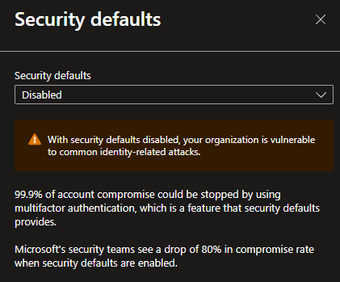
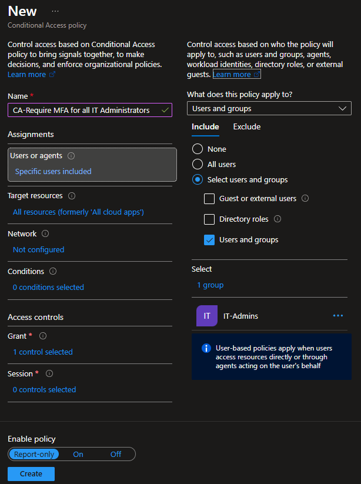
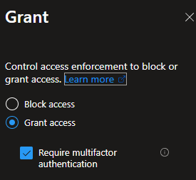
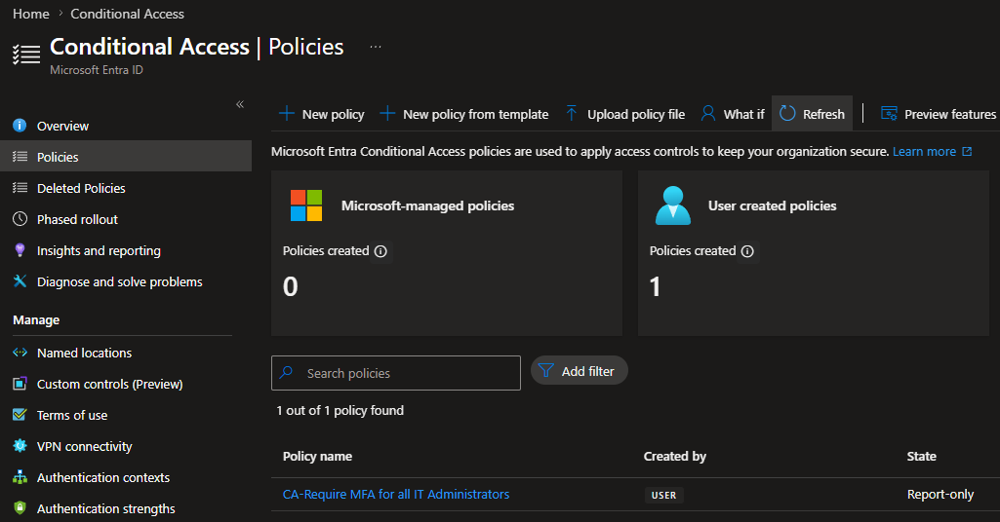

# Lab 6 – Conditional Access: Require MFA for IT Administrators

## Overview

This lab demonstrates the implementation of a Conditional Access policy to strengthen security for privileged users. The objective was to require Multi-Factor Authentication (MFA) for members of the **IT-Admins** security group before accessing organizational resources.

The policy was deployed using **Report-only mode**, allowing policy evaluation and testing prior to full enforcement.

---

## Environment

* Microsoft Entra ID P2
* Conditional Access
* Security Groups
* Multi-Factor Authentication (MFA)
* Microsoft Entra Administration Center

---

## Business Scenario

Caban Technologies identified administrative accounts as high-value targets that require additional security controls.

To align with Zero Trust principles and reduce the risk of unauthorized access, a Conditional Access policy was created to require MFA for users assigned to the **IT-Admins** group.

The policy was initially deployed in **Report-only mode** to validate policy behavior before enabling enforcement.

---

## Objectives

* Disable Security Defaults
* Create a Conditional Access policy
* Target privileged administrative users
* Require MFA for access
* Deploy using Report-only mode
* Verify successful policy creation

---

## Configuration Performed

### Step 1 – Disable Security Defaults

Security Defaults were disabled to allow the implementation of custom Conditional Access policies.

### Step 2 – Create Conditional Access Policy

**Policy Name**

CA - Require MFA for IT Administrators

### Step 3 – Assign Users

Included Group:

* IT-Admins

### Step 4 – Configure Target Resources

Protected Resources:

* All Resources (formerly All Cloud Apps)

### Step 5 – Configure Grant Controls

Access Requirement:

* Require Multi-Factor Authentication (MFA)

### Step 6 – Deploy Policy

Policy State:

* Report-only

This deployment method allows administrators to evaluate policy impact before enabling enforcement.

---

## Security Benefits

* Protects privileged administrative accounts
* Enforces strong authentication controls
* Supports Zero Trust security architecture
* Reduces risk of compromised credentials
* Provides a controlled testing methodology through Report-only deployment

---

## Evidence

### Security Defaults Disabled

### Conditional Access Policy Configuration

### MFA Grant Controls

### Conditional Access Policy Created

---

## Skills Demonstrated

* Microsoft Entra ID P2 Administration
* Conditional Access Policy Configuration
* Multi-Factor Authentication (MFA)
* Security Group Targeting
* Identity and Access Management (IAM)
* Zero Trust Security Principles
* Access Control Governance
* Microsoft Cloud Security

---

## Outcome

Successfully implemented a Conditional Access policy requiring Multi-Factor Authentication for privileged administrative users. The policy was configured to protect all organizational resources, targeted the IT-Admins security group, and was deployed using Report-only mode to support safe testing and validation before enforcement.

This lab demonstrates practical experience configuring enterprise identity security controls using Microsoft Entra Conditional Access.
