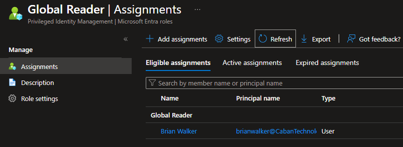
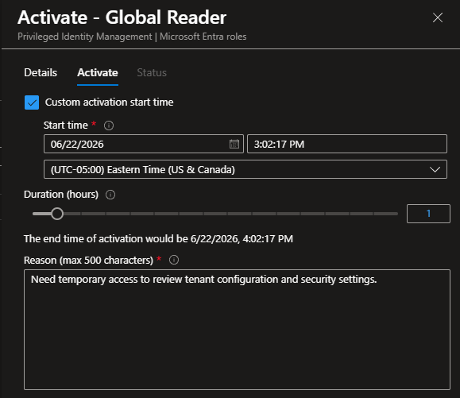
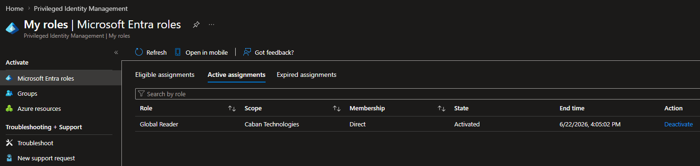
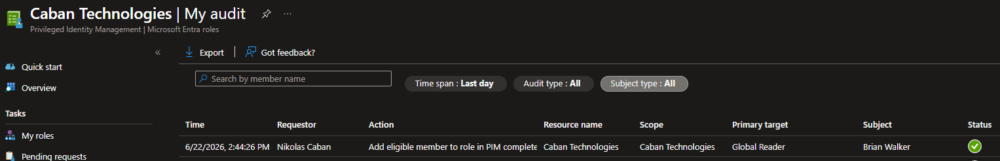

# Lab 7 – Privileged Identity Management (PIM): Just-In-Time Administrative Access

## Overview

This lab demonstrates the implementation of Microsoft Entra Privileged Identity Management (PIM) to provide Just-In-Time (JIT) administrative access.

Rather than permanently assigning administrative privileges, users are granted eligible role assignments and must activate privileged roles when elevated access is required. This approach reduces standing privilege, improves security, and aligns with Zero Trust security principles.

---

## Environment

- Microsoft Entra ID P2
- Microsoft Entra Privileged Identity Management (PIM)
- Microsoft Entra Roles
- Multi-Factor Authentication (MFA)
- Eligible Role Assignments
- Privileged Access Auditing

---

## Business Scenario

Caban Technologies wants to reduce the risk associated with permanently assigned administrative permissions.

To support the principle of least privilege, privileged access is managed through Privileged Identity Management. Administrative users receive eligible role assignments and must activate privileged access only when needed.

This lab demonstrates the complete lifecycle of assigning, activating, and auditing privileged access.

---

## Objectives

- Configure an eligible administrative role assignment
- Implement Just-In-Time (JIT) access
- Require role activation before privileged access is granted
- Provide business justification for activation
- Verify successful role activation
- Review privileged access audit logs

---

## Step 1 – Create Eligible Role Assignment

Using Microsoft Entra Privileged Identity Management, an eligible assignment was created for a test user.

### Role

Global Reader

### User

Brian Walker

### Assignment Type

Eligible

This configuration prevents permanent administrative permissions and requires the user to activate the role before privileged access is granted.

---

## Step 2 – Verify Eligible Assignment

The assigned user reviewed available roles through:

Identity Governance → Privileged Identity Management → My Roles

The Global Reader role appeared as an eligible assignment available for activation.

---

## Step 3 – Activate Privileged Role

The user initiated role activation through Privileged Identity Management.

### Activation Configuration

Role: Global Reader

Duration: 1 Hour

### Business Justification

Need temporary access to review tenant configuration and security settings.

The user completed MFA verification and submitted the activation request.

---

## Step 4 – Verify Active Role

After successful activation, the role status changed from:

Eligible

to:

Active

This demonstrates Just-In-Time privilege elevation and temporary administrative access.

---

## Step 5 – Review Audit Logs

Privileged Identity Management audit logs were reviewed to verify the activation event.

The audit trail recorded:

- User performing activation
- Activated role
- Activation timestamp
- Assignment type
- Privileged access event details

This provides accountability and visibility into administrative activity.

---

## Security Benefits

- Eliminates standing administrative access
- Reduces attack surface
- Supports Zero Trust security architecture
- Implements Just-In-Time privilege elevation
- Improves accountability through auditing
- Enforces least privilege principles
- Increases visibility into privileged access activity

---

## Evidence

### Eligible Role Assignment

### Role Activation Request

### Active Privileged Role

### PIM Audit Log

---

## Skills Demonstrated

- Microsoft Entra ID P2 Administration
- Privileged Identity Management (PIM)
- Just-In-Time (JIT) Access
- Eligible Role Assignments
- Role Activation Workflows
- Multi-Factor Authentication (MFA)
- Privileged Access Governance
- Identity Governance
- Access Auditing and Monitoring
- Zero Trust Security Principles
- Identity and Access Management (IAM)

---

## Outcome

Successfully implemented Microsoft Entra Privileged Identity Management to provide temporary administrative access through eligible role assignments.

A user was assigned the Global Reader role, activated access through the PIM workflow, completed MFA verification, and generated audit records documenting privileged access activity.

This lab demonstrates practical experience with privileged access governance, Just-In-Time administration, identity security controls, and enterprise IAM practices commonly used in modern cloud environments.

---

## Portfolio Tags

Microsoft Entra ID • PIM • Privileged Identity Management • Identity Governance • Zero Trust • IAM • Just-In-Time Access • SC-300 • Microsoft Security • Cybersecurity • Access Management • MFA
