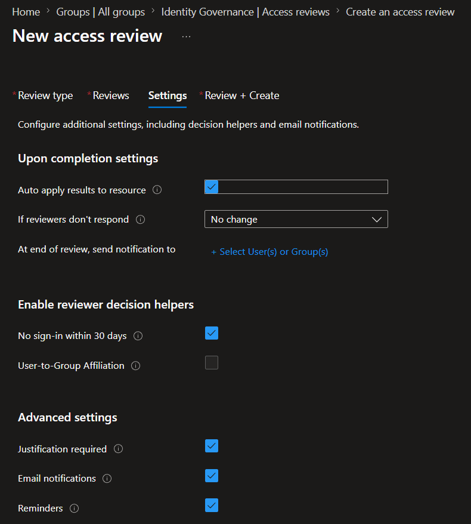
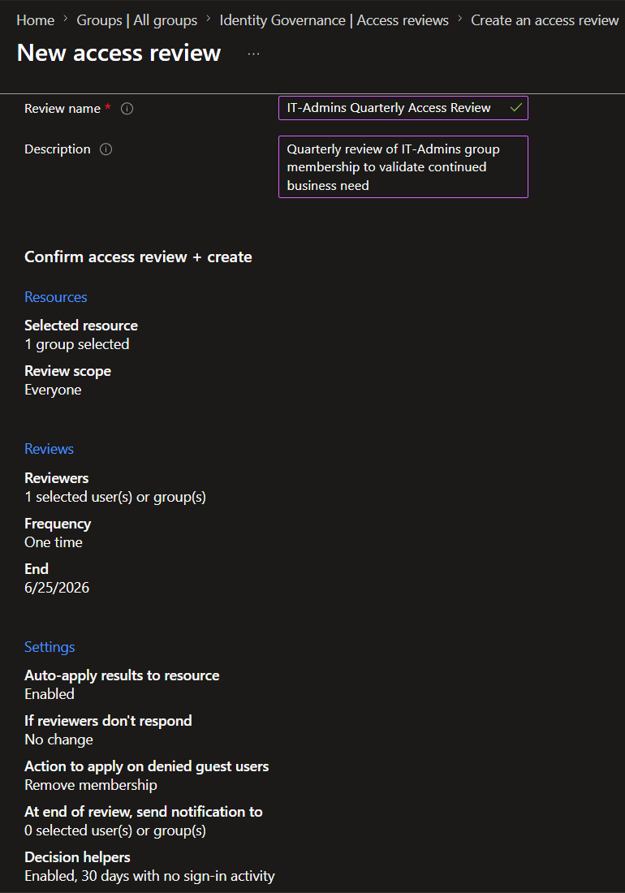
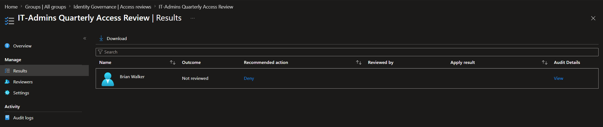
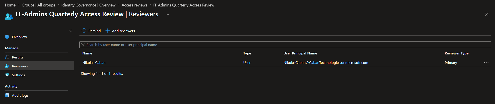
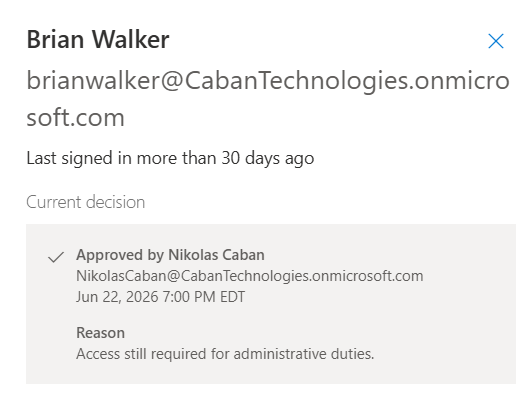

# Lab 8 – Access Reviews

## Overview

This lab demonstrates the implementation of Microsoft Entra Access Reviews to validate privileged group membership and ensure users retain only the access required for their job responsibilities.

Access Reviews are a key Identity Governance capability used to support least privilege, regulatory compliance, and periodic access certification processes.

---

## Environment

- Microsoft Entra ID P2
- Identity Governance
- Access Reviews
- Microsoft Entra Groups
- My Access Portal

---

## Business Scenario

Caban Technologies performs quarterly reviews of privileged access to ensure users still require membership in administrative groups.

The IT-Admins group contains elevated permissions and must be reviewed regularly to reduce security risk and maintain compliance with least privilege principles.

An access review was created to evaluate membership in the IT-Admins group and determine whether access should be retained.

---

## Objectives

- Create an Access Review for a privileged group
- Assign a designated reviewer
- Configure review settings and notifications
- Review privileged access through the My Access portal
- Approve or deny access based on business need
- Document the access certification process

---

## Configuration Performed

### Step 1 – Create Access Review

A new Access Review was created targeting the following group:

**Group:** IT-Admins

**Review Type:** Teams + Groups

**Scope:** All Users

**Review Name:** IT-Admins Quarterly Access Review

---

### Step 2 – Configure Review Settings

The following review settings were configured:

- Selected reviewer assigned
- Justification required
- Email notifications enabled
- Reminder notifications enabled
- One-time review schedule
- Auto-apply results enabled

These settings simulate a real-world governance process used to validate privileged access.

---

### Step 3 – Assign Reviewer

The review was assigned to:

**Reviewer:** Nikolas Caban

The reviewer was responsible for evaluating group membership and determining whether access should be retained.

---

### Step 4 – Activate Review

The review became active and was published within Microsoft Entra Identity Governance.

The review targeted members of the IT-Admins group and was available for completion through the My Access portal.

---

### Step 5 – Complete Access Review

The reviewer accessed the review through Microsoft My Access and evaluated the assigned user's membership.

**Reviewed User:** Brian Walker

**Decision:** Approve

**Justification:**

> Access still required for administrative duties.

The review was successfully submitted and recorded.

---

## Security Benefits

- Supports least privilege access control
- Validates privileged group membership
- Improves visibility into access assignments
- Provides auditability for compliance reviews
- Reduces risk of excessive permissions
- Implements governance and certification processes

---

## Evidence

### Access Review Configuration

### Access Review Summary

### Access Review Created

### Assigned Reviewer

### Completed Review Decision

---

## Skills Demonstrated

- Microsoft Entra Identity Governance
- Access Reviews
- Access Certification
- Least Privilege Administration
- Governance Controls
- Reviewer Assignment Workflows
- Identity and Access Management (IAM)
- Compliance and Audit Processes
- Microsoft Entra ID P2

---

## Outcome

Successfully implemented and completed a Microsoft Entra Access Review for a privileged administrative group. The review was configured, assigned to a reviewer, completed through the My Access portal, and documented with business justification.

This lab demonstrates practical experience with identity governance, access certification, privileged access review processes, and compliance-focused IAM controls commonly used in enterprise environments.

---

## Portfolio Tags

Microsoft Entra ID • Identity Governance • Access Reviews • IAM • Access Certification • Compliance • Least Privilege • Governance • Microsoft Security • Cybersecurity • Entra ID P2
