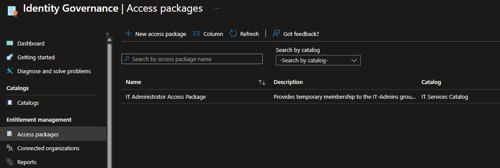
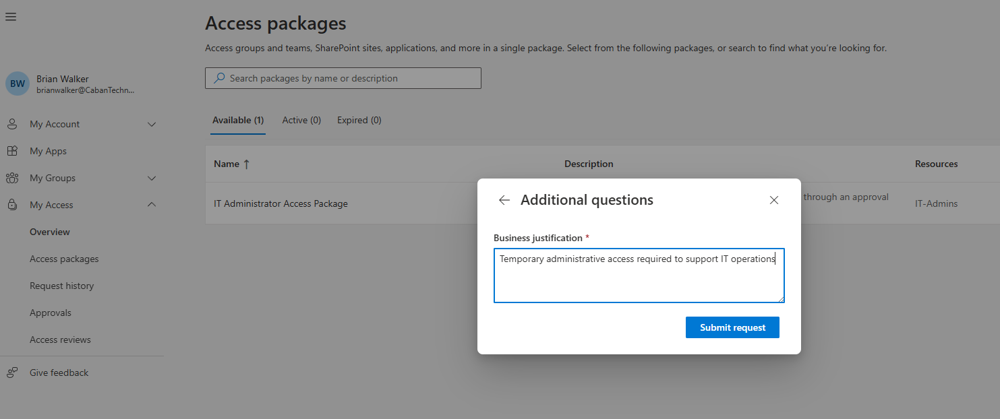
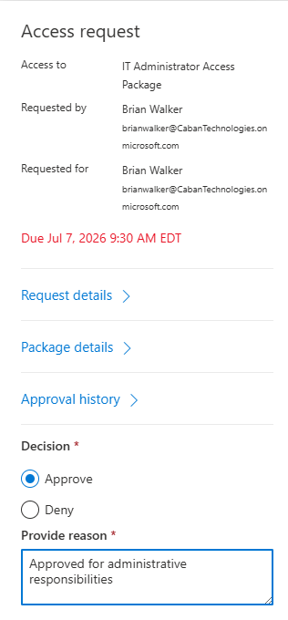
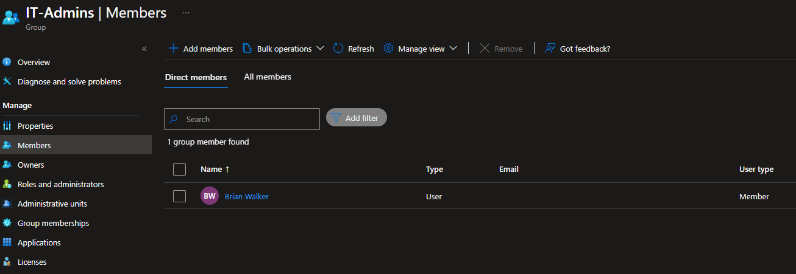

# Lab 9 – Entitlement Management with Access Packages

## Overview

This lab demonstrates Microsoft Entra ID Governance Entitlement Management using Access Packages. The solution allows users to request access to privileged resources through an approval workflow, automatically assigns access upon approval, and enforces governance controls through expiration policies.

Entitlement Management helps organizations automate access requests while maintaining least privilege and compliance requirements.

---

## Environment

- Microsoft Entra ID P2
- Microsoft Entra Identity Governance
- Entitlement Management
- Access Packages
- Security Groups
- My Access Portal

---

## Business Scenario

Caban Technologies requires users to request elevated administrative access through a controlled workflow rather than receiving direct group assignments.

The IT department implemented an Access Package that allows approved users to request membership in the IT-Admins group. Requests must be reviewed and approved before access is granted.

This process ensures privileged access is governed, auditable, and time-bound.

---

## Objectives

- Create a governance catalog
- Add resources to a catalog
- Create an Access Package
- Configure approval workflows
- Configure access expiration
- Submit an access request
- Approve a request through My Access
- Verify automatic group assignment

---

## Configuration Performed

### Step 1 – Create Catalog

A new governance catalog was created.

**Catalog Name**

```text
IT Services Catalog
```

**Purpose**

```text
Catalog containing IT access packages and administrative resources.
```

---

### Step 2 – Add Resources

The following resource was added to the catalog:

| Resource | Type |
|-----------|--------|
| IT-Admins | Security Group |

This resource will be assigned through the Access Package.

---

### Step 3 – Create Access Package

An Access Package was created to manage administrative access requests.

**Access Package Name**

```text
IT Administrator Access Package
```

**Description**

```text
Provides temporary membership to the IT-Admins group through an approval workflow.
```

---

### Step 4 – Configure Resource Roles

The package was configured to grant:

| Resource | Role |
|-----------|------|
| IT-Admins | Member |

When approved, users are automatically added to the IT-Admins group.

---

### Step 5 – Configure Request Policy

The request policy was configured with the following controls:

| Setting | Configuration |
|-----------|---------------|
| Requestors | Brian Walker |
| Approval Required | Yes |
| Approver | Nikolas Caban |
| Access Duration | 30 Days |
| Expiration Enabled | Yes |

This configuration ensures access requests are reviewed before assignment and automatically expire after the approved duration.

---

### Step 6 – Submit Access Request

Brian Walker signed into the Microsoft My Access portal and submitted a request for:

```text
IT Administrator Access Package
```

Request justification:

> Temporary administrative access required to support IT operations.

The request entered a pending approval state.

---

### Step 7 – Approve Request

The request was reviewed and approved by the designated approver.

**Approver**

```text
Nikolas Caban
```

Approval justification:

> Approved for administrative responsibilities.

After approval, the Access Package automatically provisioned membership to the IT-Admins group.

---

### Step 8 – Verify Assignment

Verification confirmed:

- Access request approved
- Access Package assigned
- Brian Walker added to IT-Admins
- Governance workflow completed successfully

---

## Security Benefits

- Centralized access request process
- Approval-based access control
- Automated group assignment
- Temporary access with expiration
- Improved auditability
- Supports least privilege principles
- Reduces manual provisioning tasks
- Enhances governance and compliance

---

## Evidence

### Access Package Created



### Access Request Submitted



### Access Request Approved



### Group Membership Verification



---

## Skills Demonstrated

- Microsoft Entra Identity Governance
- Entitlement Management
- Access Packages
- Approval Workflows
- Access Request Automation
- Security Group Governance
- Identity Lifecycle Management
- Least Privilege Administration
- Compliance Controls
- Microsoft Entra ID P2

---

## Outcome

Successfully implemented Microsoft Entra Entitlement Management using Access Packages. Users can request administrative access through a governed approval process, receive access automatically after approval, and have access expire based on defined lifecycle policies.

This lab demonstrates real-world IAM governance workflows commonly used in enterprise environments to manage privileged access and reduce manual provisioning efforts.

---

## Portfolio Tags

Microsoft Entra ID • Identity Governance • Entitlement Management • Access Packages • IAM • Access Governance • Approval Workflows • Least Privilege • Microsoft Security • Cybersecurity • Entra ID P2
