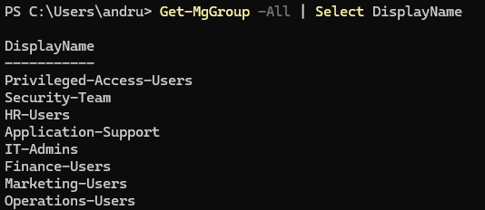
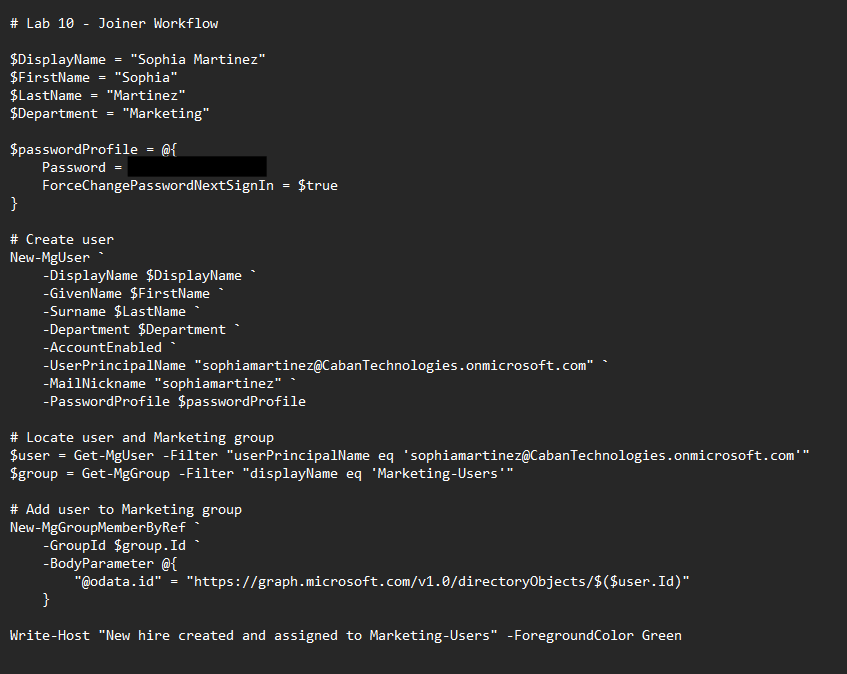
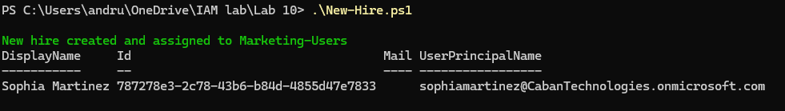
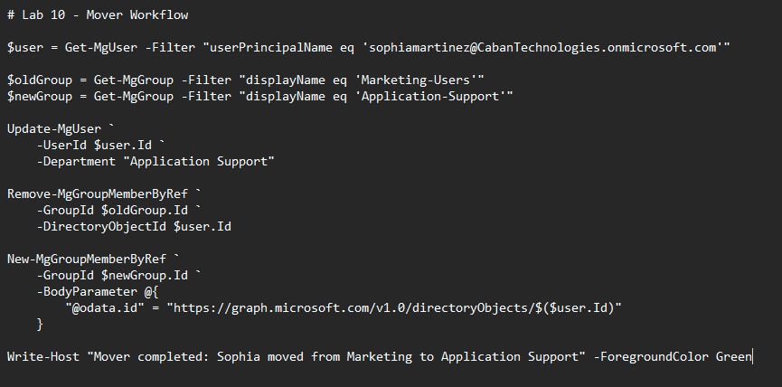
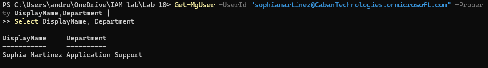
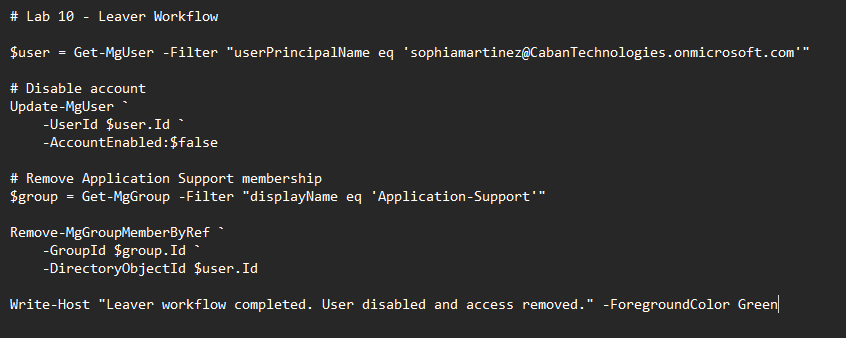
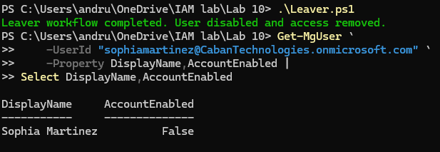
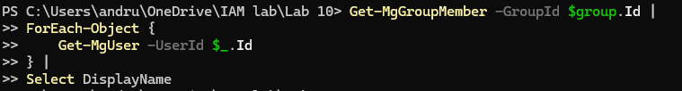

# Lab 10 – Joiner, Mover, Leaver (JML) Lifecycle Automation with Microsoft Graph

## Overview

This lab demonstrates the automation of the employee identity lifecycle using Microsoft Graph PowerShell. The workflow simulates the three core phases of identity lifecycle management commonly used in enterprise Identity and Access Management (IAM) programs:

* Joiner (New Employee Onboarding)
* Mover (Department and Access Changes)
* Leaver (Employee Offboarding)

The lab automates user provisioning, access modifications, and account deprovisioning to reduce manual administration and improve governance.

---

## Environment

* Microsoft Entra ID
* Microsoft Graph PowerShell
* Security Groups
* User Lifecycle Management
* PowerShell Automation

---

## Business Scenario

Caban Technologies wants to automate employee lifecycle processes to ensure access is provisioned and removed consistently.

The IAM team implemented automated workflows that:

* Create and onboard new employees
* Modify access when employees change departments
* Disable accounts and remove access when employees leave the organization

This approach reduces administrative overhead and supports security best practices.

---

## Objectives

* Automate new user onboarding
* Automate department transfers
* Automate access modifications
* Automate user offboarding
* Remove access during termination
* Demonstrate identity lifecycle management using Microsoft Graph

---

## Joiner Workflow

### New Hire Created

A PowerShell onboarding script was developed to automate new employee provisioning.

**New Employee**

```text
Sophia Martinez
```

**Department**

```text
Marketing
```

### Automated Actions

* Create user account
* Assign department attribute
* Enable account
* Generate temporary password
* Add user to Marketing-Users group

### Outcome

The user account was successfully created and assigned appropriate access based on department.

---

## Mover Workflow

### Department Transfer

The employee was transferred from:

```text
Marketing
```

to:

```text
Application Support
```

### Automated Actions

* Update Department attribute
* Remove previous access assignments
* Assign new departmental access
* Modify group memberships

### Outcome

The employee's identity attributes and access permissions were updated to reflect their new role.

---

## Leaver Workflow

### Employee Offboarding

A PowerShell offboarding script was executed to remove access and disable the user account.

### Automated Actions

* Disable user account
* Remove security group memberships
* Revoke departmental access
* Complete access removal process

### Outcome

The user account was disabled and access was successfully removed from organizational resources.

---

## Security Benefits

* Reduces manual provisioning errors
* Enforces standardized onboarding procedures
* Supports least privilege access principles
* Improves access governance
* Accelerates employee onboarding and offboarding
* Reduces orphaned accounts and excessive permissions
* Enhances security through automated access removal

---

## Evidence

### Security Groups Created



### Joiner Automation Script



### New User Created



### Mover Automation Script



### Department Updated



### Leaver Automation Script



### User Disabled



### Access Removed



---

## Skills Demonstrated

* Microsoft Graph PowerShell
* Identity Lifecycle Management
* Joiner, Mover, Leaver (JML) Processes
* User Provisioning
* User Offboarding
* Security Group Administration
* Access Governance
* PowerShell Automation
* Microsoft Entra ID Administration
* Identity and Access Management (IAM)

---

## Outcome

Successfully implemented automated Joiner, Mover, and Leaver workflows using Microsoft Graph PowerShell. The solution demonstrated user onboarding, departmental transfers, access modifications, and offboarding activities commonly performed by enterprise IAM teams.

This lab showcases practical experience with identity lifecycle management, automation, governance, and Microsoft Entra administration in a cloud identity environment.

---

## Portfolio Tags

Microsoft Entra ID • Microsoft Graph • PowerShell • IAM • Identity Lifecycle Management • JML • User Provisioning • Offboarding • Access Governance • Identity Automation • Cybersecurity
