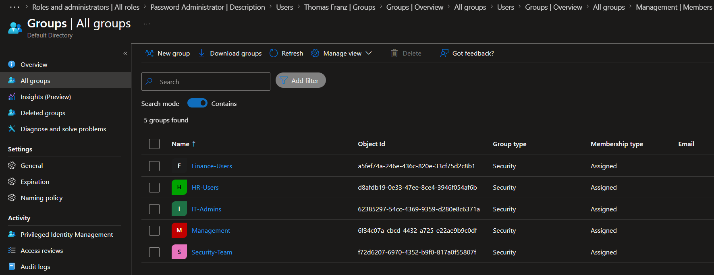
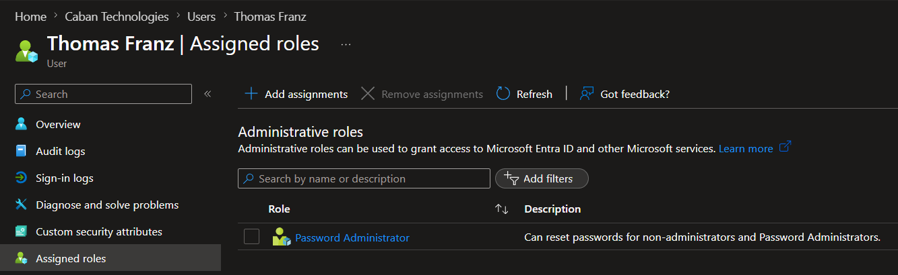
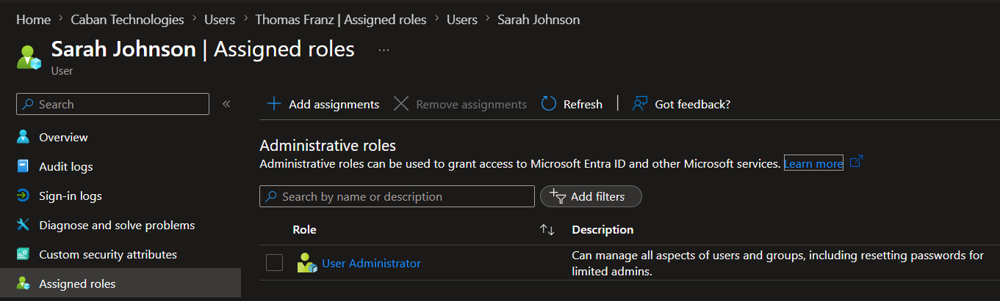
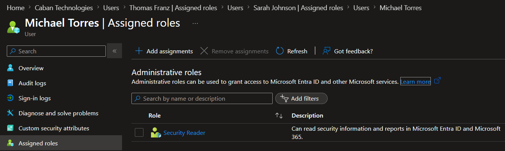
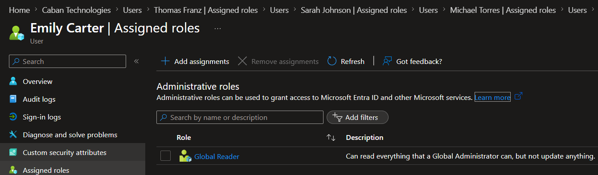

# Lab 2 - Administrative Roles and RBAC

## Overview

This lab demonstrates Role-Based Access Control (RBAC) and delegated administration within Microsoft Entra ID.

**Caban Technologies**, requires different administrative permissions for employees based on their job responsibilities. Administrative roles were assigned according to the principle of least privilege, ensuring users receive only the access necessary to perform their duties.

---

## Objectives

- Create administrative user accounts
- Assign Microsoft Entra administrative roles
- Implement Role-Based Access Control (RBAC)
- Apply least-privilege access principles
- Document administrative role assignments
- Demonstrate delegated administration concepts

---

## Business Scenario

Caban Technologies requires multiple levels of administrative access within its Identity and Access Management (IAM) environment.

Different employees are responsible for different functions, including password management, user administration, security monitoring, and tenant visibility. Rather than granting full administrative access to all users, permissions are delegated using built-in Microsoft Entra roles.

---

## Administrative Users

| User | Department | Group | Administrative Role |
|--------|--------|--------|--------|
| Thomas Franz | IT | IT-Admins | Password Administrator |
| Sarah Johnson | IT | IT-Admins | User Administrator |
| Michael Torres | Security | Security-Team | Security Reader |
| Emily Carter | IT Management | Management | Global Reader |

---

## Administrative Roles Implemented

### Password Administrator
**Assigned to:** Thomas Franz

Responsibilities:
- Reset passwords for users
- Support account recovery operations
- Perform help desk identity functions

### User Administrator
**Assigned to:** Sarah Johnson

Responsibilities:
- Create and manage user accounts
- Manage group memberships
- Maintain identity records

### Security Reader
**Assigned to:** Michael Torres

Responsibilities:
- Review security information
- Monitor security-related events
- Investigate security issues without modification privileges

### Global Reader
**Assigned to:** Emily Carter

Responsibilities:
- View tenant configuration and settings
- Audit identity infrastructure
- Maintain visibility without administrative control

---

## Security Analysis

This lab demonstrates the principle of least privilege by assigning only the permissions required for each job function.

Administrative responsibilities were separated across multiple users to reduce risk and improve accountability. Users were assigned both security groups and Microsoft Entra administrative roles to support access management and delegated administration requirements.

---

## Key Concepts Demonstrated

- Microsoft Entra ID Administration
- Role-Based Access Control (RBAC)
- Least Privilege
- Delegated Administration
- Administrative Role Assignment
- Security Group Management
- Identity Governance Fundamentals

---

## Evidence

### Security Groups

### Thomas Franz - Password Administrator

### Sarah Johnson - User Administrator

### Michael Torres - Security Reader

### Emily Carter - Global Reader

---

## Outcome

Successfully implemented a role-based administrative model in Microsoft Entra ID using built-in administrative roles, security groups, and least-privilege access controls.
