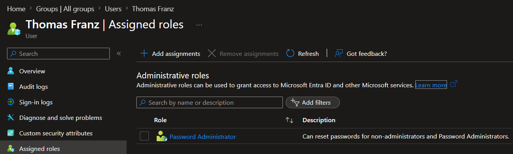
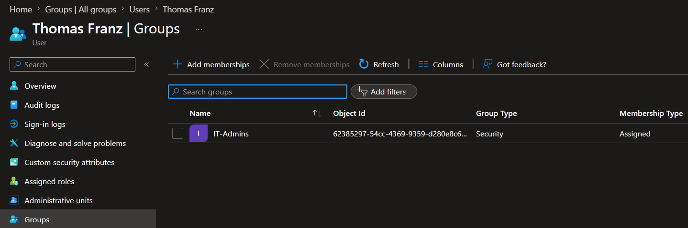
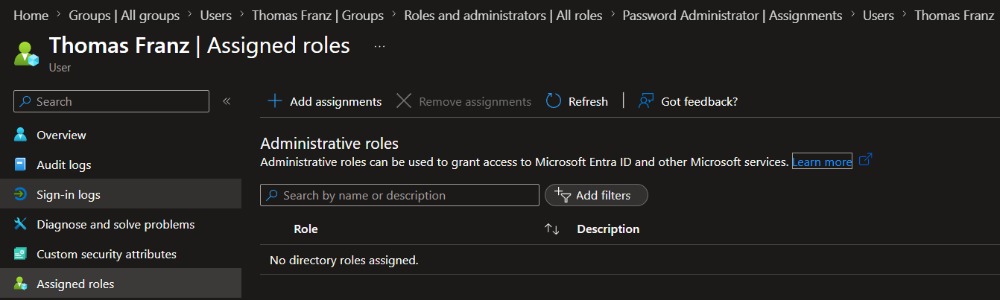
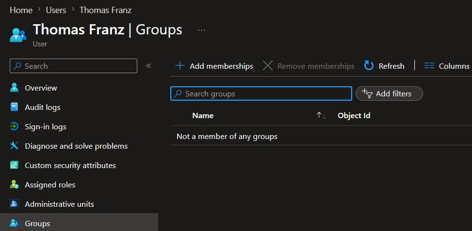
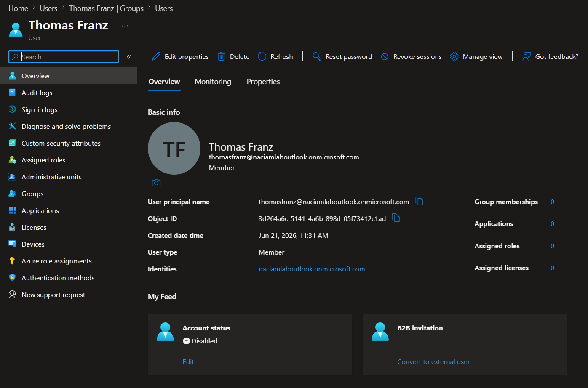

# Lab 3 - User Offboarding and Access Deprovisioning

## Overview

This lab demonstrates the user offboarding process within Microsoft Entra ID.

Thomas Franz, is leaving Caban Technologies. The Identity and Access Management (IAM) team is responsible for removing administrative privileges, revoking group-based access, disabling account access, and documenting the deprovisioning process.

This lab focuses on the principle of least privilege and proper access removal procedures to reduce organizational risk.

---

## Objectives

- Review existing user access
- Remove administrative role assignments
- Remove security group memberships
- Disable user account access
- Verify access removal
- Document the offboarding process

---

## Business Scenario

Thomas Franz is departing Caban Technologies.

As part of the organization's offboarding policy, the IAM team must ensure that all access is removed before separation is completed. This includes revoking administrative privileges, removing group memberships, and disabling the user account to prevent future access.

---

## User Being Offboarded

| User | Department | Group | Administrative Role |
|--------|--------|--------|--------|
| Thomas Franz | IT | IT-Admins | Password Administrator |

---

## Offboarding Tasks Performed

### Step 1 - Access Review

Reviewed the user's current access and documented:

- Existing administrative role assignments
- Existing security group memberships
- Current account status

### Step 2 - Administrative Role Removal

Removed:

- Password Administrator

This ensured the user no longer retained privileged administrative access.

### Step 3 - Security Group Removal

Removed membership from:

- IT-Admins

This revoked access associated with the security group.

### Step 4 - Account Disablement

Disabled the Thomas Franz account to prevent future authentication and access to organizational resources.

### Step 5 - Verification

Verified that:

- Administrative role assignments were removed
- Group memberships were removed
- User account was disabled

---

## Security Analysis

Proper user offboarding is a critical IAM function.

Failure to remove administrative privileges and account access can create unnecessary security risks and leave former employees with unauthorized access to organizational resources.

This lab demonstrates a structured deprovisioning process that follows security best practices and supports the principle of least privilege.

---

## Key Concepts Demonstrated

- Identity Lifecycle Management
- User Offboarding
- Access Deprovisioning
- Administrative Role Management
- Security Group Management
- Least Privilege
- Access Revocation
- IAM Documentation

---

## Evidence

### User Overview Before Offboarding

### Administrative Role Before Offboarding

### Group Membership Before Offboarding

### Administrative Role Removed

### Group Membership Removed

### Account Disabled

---

## Outcome

Successfully completed the offboarding process for a privileged user by removing administrative access, revoking group memberships, disabling account access, and verifying access removal within Microsoft Entra ID.
